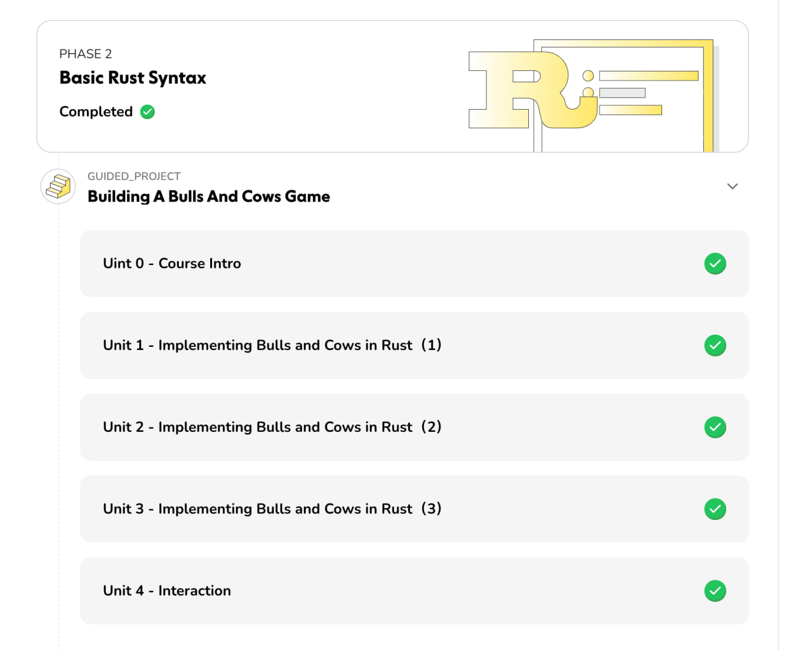

# Bulls and Cows Game 🎯

A simple number guessing game built in Rust as part of an Eclipse guided project from [Hackquest.io](https://hackquest.io).



## About the Game

Bulls and Cows is a classic number guessing game where players try to guess a secret number within a limited number of attempts. In this implementation:

- The computer generates a random number between 1 and 10
- Players have up to 10 attempts to guess the correct number
- After each guess, the game provides hints:
  - "Too small!" if your guess is lower than the secret number
  - "Too big!" if your guess is higher than the secret number
  - "Congratulation you're right!" when you guess correctly
- After 5 attempts, the game shows how many tries you've made
- If you don't guess within 10 attempts, the game ends

## Features

- Random number generation using the `rand` crate
- Input validation (ensures numbers are between 1-10)
- Error handling for invalid input
- Attempt counter with hints
- Maximum attempt limit

## Prerequisites

- [Rust](https://www.rust-lang.org/tools/install) (latest stable version)
- Cargo (comes with Rust)

## Installation & Running

1. Clone this repository:
   ```bash
   git clone <repository-url>
   cd bulls_and_cows
   ```

2. Build and run the game:
   ```bash
   cargo run
   ```

   Or build first, then run:
   ```bash
   cargo build --release
   ./target/release/bulls_and_cows
   ```

## How to Play

1. Run the game using `cargo run`
2. When prompted, enter a number between 1 and 10
3. Follow the hints ("Too small!" or "Too big!") to adjust your next guess
4. Try to guess the secret number within 10 attempts
5. The game will show your total attempts when you win or lose

## Example Gameplay

```
Welcome to Bulls and Cows!
Please input a number: 
5
Too small!
Please input a number: 
8
Too big!
Please input a number: 
7
Congratulation you're right!
tips: you have tried 3 times
```

## Project Structure

```
bulls_and_cows/
├── Cargo.toml          # Project configuration and dependencies
├── Cargo.lock          # Dependency lock file
├── README.md           # This file
├── src/
│   └── main.rs         # Main game logic
├── images/
│   └── hackquest.jpg   # Hackquest logo
└── target/             # Build artifacts (generated)
```

## Dependencies

- `rand = "0.8"` - For random number generation
